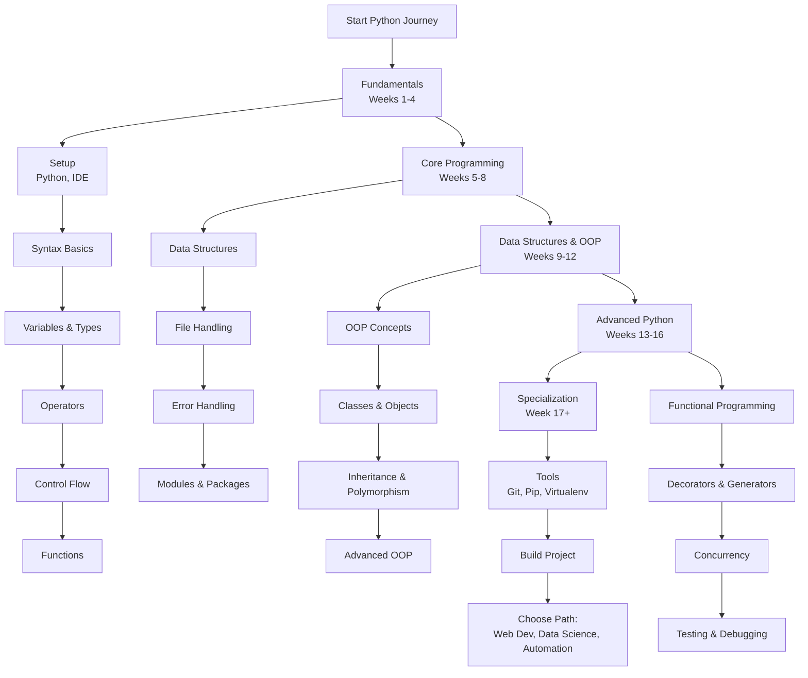

# Python Developer Learning Path: A Structured Curriculum

This comprehensive roadmap provides a structured approach to mastering Python development. The curriculum is designed sequentially, with each module building upon previous knowledge to ensure a solid foundation and progressive skill development.

---

## Phase 1: Python Fundamentals & Syntax (Weeks 1-4)

*   [**Module 1: Introduction & Development Environment**](https://github.com/ahmadrizal1st/python-intro/#readme)
    *   Python Overview: History, Philosophy, and Key Characteristics (Readable, Versatile, Batteries Included)
    *   Understanding Python Versions: Python 2 vs Python 3
    *   Installing Python and Configuring Environment Variables
    *   Setting Up an Integrated Development Environment (VS Code/PyCharm Recommended)
    *   Creating and Executing a "Hello World" Application
    *   Using Python REPL (Read-Eval-Print Loop)

*   [**Module 2: Basic Syntax & Program Structure**](https://github.com/ahmadrizal1st/python-syntax/#readme)
    *   Python Syntax: Indentation-based Code Blocks
    *   Code Documentation: Comments (`#`) and Docstrings (`""" """`)
    *   Variables and Naming Conventions (snake_case)
    *   Basic Input/Output: `print()` and `input()` Functions
    *   Importing Modules: `import` statement

*   [**Module 3: Variables and Data Types**](https://github.com/ahmadrizal1st/python-variables/#readme)
    *   Basic Data Types: `int`, `float`, `str`, `bool`
    *   Complex Data Types: `list`, `tuple`, `dict`, `set`
    *   Variable Assignment and Dynamic Typing
    *   Type Conversion: `int()`, `str()`, `float()`, `bool()`
    *   None Type and Identity Operators

*   [**Module 4: Operators and Expressions**](https://github.com/ahmadrizal1st/python-operators/#readme)
    *   Arithmetic Operators: `+`, `-`, `*`, `/`, `//`, `%`, `**`
    *   Comparison Operators: `==`, `!=`, `>`, `<`, `>=`, `<=`
    *   Logical Operators: `and`, `or`, `not`
    *   Assignment Operators: `=`, `+=`, `-=`, `*=`, `/=`
    *   Membership Operators: `in`, `not in`
    *   Identity Operators: `is`, `is not`

*   [**Module 5: Control Flow Statements**](https://github.com/ahmadrizal1st/python-control-flow/#readme)
    *   Conditional Statements: `if`, `elif`, `else`
    *   Iteration Statements: `for` loops and `while` loops
    *   Loop Control: `break`, `continue`, `pass` statements
    *   Conditional Expressions: Ternary Operator
    *   Range function and Iteration techniques

*   [**Module 6: Functions**](https://github.com/ahmadrizal1st/python-functions/#readme)
    *   Function Definition: `def` keyword and function calls
    *   Parameters and Arguments: Positional, Keyword, Default
    *   Return Values and Multiple Returns
    *   Variable Scope: Local vs Global variables
    *   Lambda Functions: Anonymous functions
    *   Function Documentation and Best Practices

---

## Phase 2: Core Programming Concepts (Weeks 5-8)

*   [**Module 7: Data Structures**](https://github.com/ahmadrizal1st/python-data-structures/#readme)
    *   **Lists**: Creation, indexing, slicing, methods, list comprehensions
    *   **Tuples**: Immutable sequences, packing/unpacking
    *   **Dictionaries**: Key-value pairs, methods, dictionary comprehensions
    *   **Sets**: Unordered collections, set operations
    *   **Strings**: String methods, formatting, manipulation

*   [**Module 8: File Handling**](https://github.com/ahmadrizal1st/python-file-handling/#readme)
    *   File Operations: `open()`, `read()`, `write()`, `close()`
    *   File Modes: Read, Write, Append, Binary modes
    *   Context Managers: `with` statement for automatic resource management
    *   Reading/Writing different file formats: Text, CSV, JSON
    *   File and Directory operations with `os` module

*   [**Module 9: Error and Exception Handling**](https://github.com/ahmadrizal1st/python-exceptions/#readme)
    *   Exception Types: Built-in exceptions hierarchy
    *   Handling Exceptions: `try`, `except`, `else`, `finally` blocks
    *   Raising Exceptions: `raise` statement
    *   Custom Exceptions: Creating user-defined exception classes
    *   Exception Best Practices and Common Patterns

*   [**Module 10: Modules and Packages**](https://github.com/ahmadrizal1st/python-modules/#readme)
    *   Importing Modules: Different import techniques
    *   Standard Library Overview: Commonly used modules (`os`, `sys`, `math`, `datetime`)
    *   Creating Packages: `__init__.py` and package structure
    *   Module Search Path and `sys.path`
    *   Virtual Environments and dependency management

---

## Phase 3: Object-Oriented Programming & Advanced Data Structures (Weeks 9-12)

*   [**Module 11: Introduction to OOP**](https://github.com/ahmadrizal1st/python-oop-intro/#readme)
    *   Principles of Object-Oriented Programming (OOP)
    *   Classes as Blueprints and Objects as Instances
    *   Defining Classes: `class` keyword and class attributes
    *   Constructors: `__init__` method and instance variables
    *   Methods: Instance methods, static methods, class methods

*   [**Module 12: Classes and Objects**](https://github.com/ahmadrizal1st/python-classes/#readme)
    *   Instance Variables vs Class Variables
    *   Method Types: Instance methods, static methods (`@staticmethod`), class methods (`@classmethod`)
    *   Properties and Data Encapsulation
    *   Special/Magic Methods: `__str__`, `__repr__`, `__len__`, etc.

*   [**Module 13: Inheritance and Polymorphism**](https://github.com/ahmadrizal1st/python-inheritance/#readme)
    *   **Inheritance**: Single, Multiple, and Multi-level inheritance
    *   Method Overriding and `super()` function
    *   **Polymorphism**: Duck typing and operator overloading
    *   Abstract Base Classes (ABCs) and `@abstractmethod`
    *   Method Resolution Order (MRO) in multiple inheritance

*   [**Module 14: Advanced OOP Concepts**](https://github.com/ahmadrizal1st/python-advanced-oop/#readme)
    *   **Encapsulation**: Private members and name mangling
    *   **Composition** vs **Inheritance**
    *   Operator Overloading with special methods
    *   Class decorators and metaclasses (basic concepts)
    *   Design Patterns in Python

---

## Phase 4: Advanced Python Features (Weeks 13-16)

*   [**Module 15: Functional Programming**](https://github.com/ahmadrizal1st/python-functional/#readme)
    *   First-class functions and higher-order functions
    *   Built-in functions: `map()`, `filter()`, `reduce()`
    *   List Comprehensions, Dictionary Comprehensions, Set Comprehensions
    *   Generator Expressions and their advantages
    *   Functional programming tools: `functools` module

*   [**Module 16: Decorators and Generators**](https://github.com/ahmadrizal1st/python-decorators-generators/#readme)
    *   Function Decorators: Creation and usage with `@` syntax
    *   Class Decorators and parameterized decorators
    *   Generators: `yield` keyword and generator functions
    *   Generator vs List Comprehensions
    *   Context Managers with `__enter__` and `__exit__`

*   [**Module 17: Concurrency and Parallelism**](https://github.com/ahmadrizal1st/python-concurrency/#readme)
    *   Threading: `threading` module for I/O-bound tasks
    *   Multiprocessing: `multiprocessing` module for CPU-bound tasks
    *   Asynchronous Programming: `asyncio` basics
    *   Global Interpreter Lock (GIL) and its implications
    *   Concurrent.futures for high-level concurrency

*   [**Module 18: Testing and Debugging**](https://github.com/ahmadrizal1st/python-testing/#readme)
    *   Unit Testing: `unittest` framework and test cases
    *   pytest: Writing and running tests with pytest
    *   Debugging Techniques: `pdb` debugger and logging
    *   Test-driven Development (TDD) basics
    *   Mocking and patching for testing

---

## Phase 5: Professional Development & Specialization

*   [**Module 19: Essential Development Tools**](https://github.com/ahmadrizal1st/python-dev-tools/#readme)
    *   Package Management: **pip** and virtual environments (`venv`)
    *   Version Control: **Git** fundamentals and GitHub
    *   Code Quality: Linters (`pylint`, `flake8`) and formatters (`black`)
    *   Dependency Management: `requirements.txt` and `pyproject.toml`
    *   Project Structure and Best Practices

*   [**Module 20: Capstone Project & Career Specialization**](https://github.com/ahmadrizal1st/python-capstone/#readme)
    *   **Develop a Complete Python Application** (Web app, Data analysis tool, or Automation script)
    *   **Select a Specialization Path:**
        *   **Web Development**: Django/Flask frameworks, REST APIs, Databases
        *   **Data Science & ML**: NumPy, Pandas, Matplotlib, Scikit-learn
        *   **Automation & Scripting**: System administration, Web scraping, Task automation
        *   **DevOps & Cloud**: Docker, AWS, CI/CD pipelines with Python
